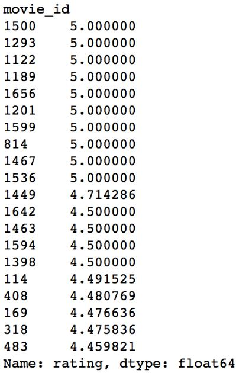

# Recommendation-system
This is a collaborative project made for bertelsmann  scholarship challenge  
We have used python graphlab package ,which helped us to finish this project faster .
We took the data set from https://grouplens.org/datasets/movielens/100k/ and we used only u.data, u.item and u.user from the zip file of ml-100k.zip .
We divided the data set in test and train .We trained our model i.e. graphlab on train data and tested our model on dataset.
thus obtaining the result as following :

